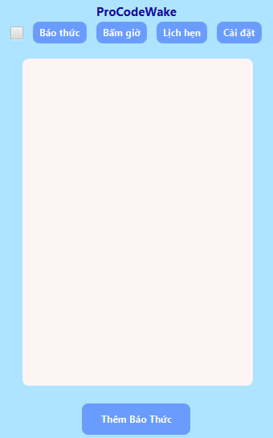
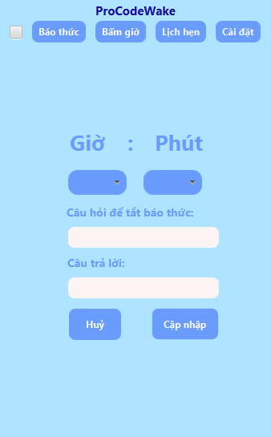
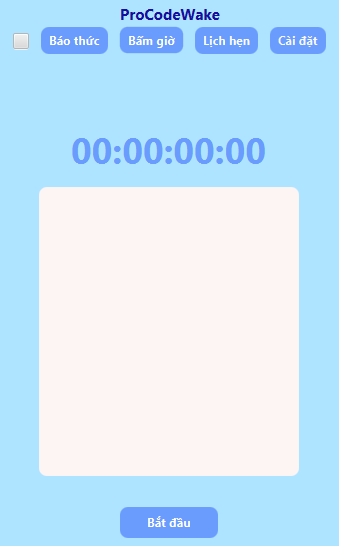
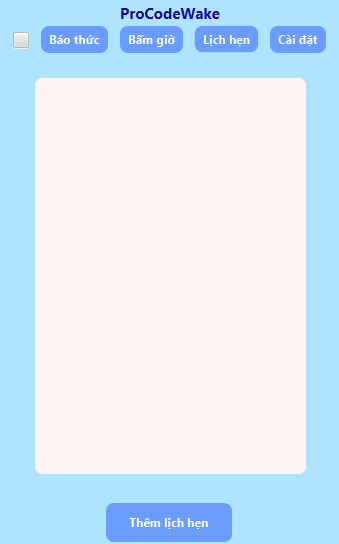
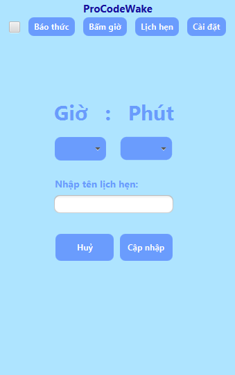
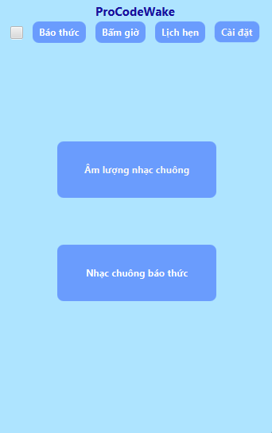
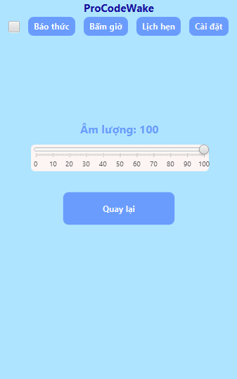
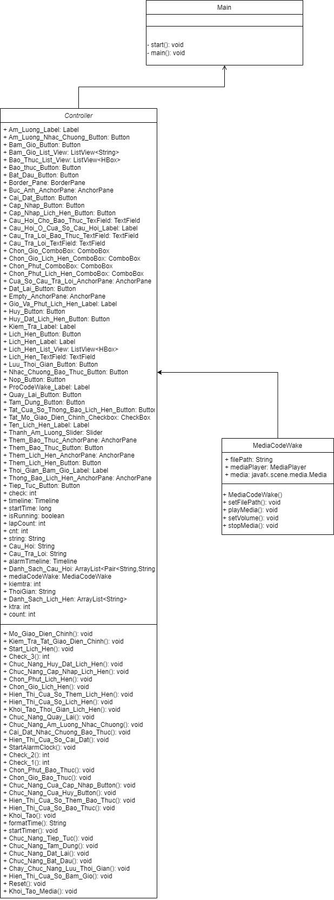

# ProCodeWake

- **ProCodeWake** là một ứng dụng dành cho những người hay ngủ quên, hay quên những cuộc hẹn, công việc, hoạt động nào đó vào một thời gian nào đó hoặc muốn đếm thời gian cho hoạt động nào đó. 
## Demo

Link Video Demo: https://youtu.be/Ubx121LWPrc


## Screenshots

 






## Features

- Ứng dụng cung cấp 3 chức năng chính là báo thức, bấm giờ, lịch hẹn và 1 chức năng phụ là cài đặt:
    + ***Báo thức:*** Cung cấp cho bạn 1 đồng hồ báo thức. Khi bạn đặt báo thức thì phải kèm theo 1 cặp câu hỏi và câu trả lời để khi đến thời gian báo thức chuông kêu bạn phải trả lời câu hỏi thì mới tắt được báo thức.
    + ***Bấm giờ:*** Cung cấp cho bạn 1 đồng hồ bấm giờ và 1 số chức năng lưu thời gian bấm giờ, tạm dừng bấm giờ,...
    + ***Lịch hẹn:*** Cung cấp cho bạn 1 đồng hồ báo lịch hẹn. Đồng hồ này sẽ thông báo lịch hẹn mà bạn đặt thời gian. 
    + ***Cài đặt:*** Cung cấp 2 chức năng đó là tuỳ chỉnh âm lượng và chọn nhạc chuông khác từ máy của bạn.

## UML

## Requirements

- Java 17.0.2
- Maven 3.8.5
## Installation

- Cách cài đặt dự án

```bash
  - Clone dự án
  - Mở theo đường dẫn này ProCodeWake\demo\src\main\java\com\example\demo, mở file Main.java sau đó ấn run trên IDE của bạn để chạy ứng dụng
```
    

## Contact
- Có thắc mắc gì hoặc hỏi về phần nào trong dự án của tôi thì hãy liên hệ với tôi qua:
    + FaceBook: https://www.facebook.com/profile.php?id=100013389669628

